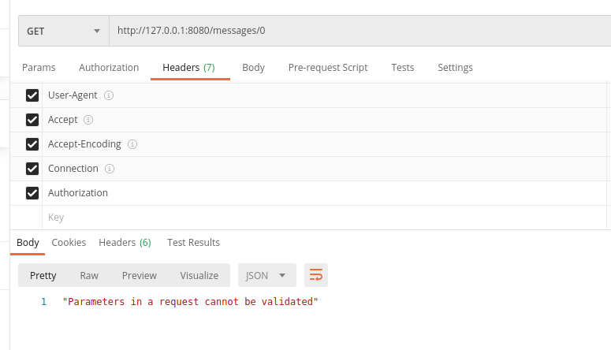

## app_chat aplication
gunicorn -c settings.py example:api  --reload

Аутентификация (через headrs), регистрация пользователей - реализовано 
регистрация пользователей проходит при отправке своих данных на url:

1. POST: http://127.0.0.1:8080/register
В качестве ответа приходит access token

2. Аутентификация (через headrs)

### Примеры запросов
3. POST: http://127.0.0.1:8080/chats создание чата 
создать чат может любой пользователь у которого есть access token - реализовано

PUT, PATCH, DELETE: http://127.0.0.1:8080/chats/{chat_id}
обновить чат, удалить чат может только создатель чата

4. GET: http://127.0.0.1:8080/info/0

получить информацию о чате
Любой участник чата

5. POST: http://127.0.0.1:8080/members

Добавить пользователя в чат

6. DELETE http://127.0.0.1:8080/members

Выгнать пользователя из чата

пользователь не имеет более доступа к ресурсам чата

7. http://127.0.0.1:8080/members/0
Получить всех участников чата, может владелец чата и участник

8. POST: http://127.0.0.1:8080/messages отправка сообщения в чат
отправить сообщение в чат может владелец чата - реализовано
отправить сообщение может участник  - реализовано

GET: http://127.0.0.1:8080/messages/0

9. Получать все сообщения чата, получить может владелец чата
и участник чата - реализовано

